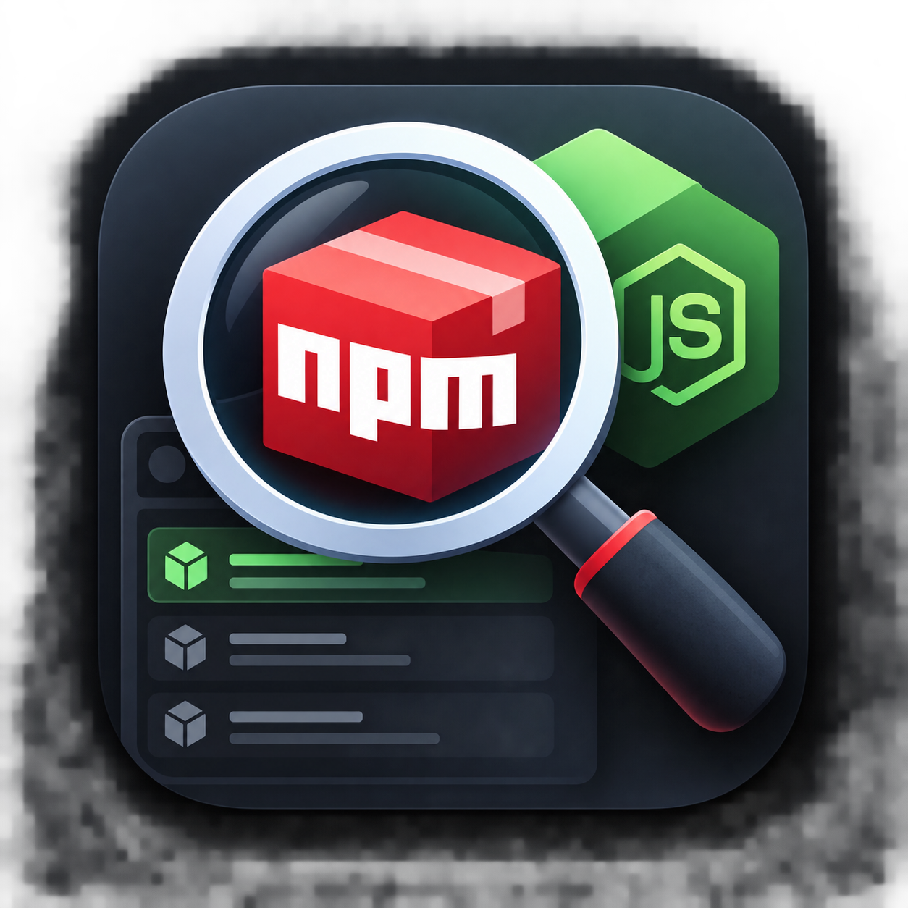

<p align="center">
  
</p>

<h1 align="center">NodeSweep</h1>

<p align="center">Clean unused <code>node_modules</code>. Keep what matters.</p>

NodeSweep is a small Windows app that finds `node_modules` folders in projects you haven't worked on for a while and lets you delete them. You can always get them back with `npm install`.

## Download

Get the installer from the [Releases](https://github.com/aflahsidhique/nodesweep/releases/latest) page.

The installer isn't code-signed, so Windows SmartScreen will probably warn you. Click "More info", then "Run anyway".

## Features

- Scan a folder or a whole drive
- Only show projects that haven't changed in 7 to 60 days (checks `package.json`, lockfiles and optionally `.git/HEAD`)
- Skip anything smaller than a minimum size
- Pick what to delete and confirm before anything is removed
- Error console behind the settings icon in the title bar

## Safety

Before deleting, the main process checks that the path is a folder called `node_modules`, that it's inside one of the folders you scanned, and that it still exists. Anything else is refused. The scanner doesn't follow symlinks and skips folders like `.git`, `dist`, `build` and `.next`.

## Development

You need Node.js 20 or newer.

```bash
npm install
npm run dev
npm test
npm run typecheck
npm run lint
```

To build the Windows installer:

```bash
npm run build:win
```

The installer ends up in `dist/`. Installer images and the welcome page text are in `build/`.

If the build fails because `app.asar` is in use, VS Code is probably holding it open. Close VS Code completely and try again.

## License

[MIT](LICENSE)
